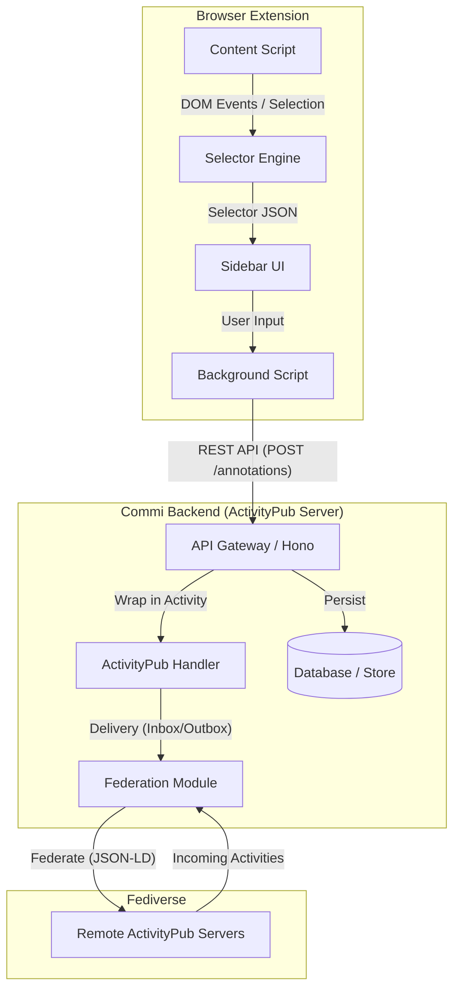

# ActivityPub Annotation Extension — Architecture & Implementation

## 1. High-level Architecture



## 2. JSON-LD Schemas

### Vocabulary
Namespace: `https://commi.app/ns/annotation#`

### Annotation Object
```json
{
  "@context": [
    "https://www.w3.org/ns/activitystreams",
    "https://commi.app/ns/annotation.jsonld"
  ],
  "type": "Note",
  "id": "https://commi.app/users/alice/notes/123",
  "attributedTo": "https://commi.app/users/alice",
  "content": "This is a crucial point in the argument.",
  "inReplyTo": "https://example.com/article.html",
  "target": {
    "type": "Link",
    "href": "https://example.com/article.html",
    "selector": {
      "type": "TextQuoteSelector",
      "exact": "crucial point",
      "prefix": "This is a ",
      "suffix": " in the argument."
    }
  },
  "published": "2025-12-24T10:00:00Z"
}
```

### Video Annotation (Timestamp)
```json
{
  "type": "Note",
  "content": "Look at this background detail!",
  "target": {
    "type": "Link",
    "href": "https://youtube.com/watch?v=dQw4w9WgXcQ",
    "selector": {
      "type": "TimestampSelector",
      "start": "PT1M30S",
      "end": "PT1M35S"
    }
  }
}
```

### Selectors

#### TextQuoteSelector
```json
{
  "type": "TextQuoteSelector",
  "exact": "target text",
  "prefix": "context before ",
  "suffix": " context after"
}
```

#### DOMSelector
```json
{
  "type": "DOMSelector",
  "value": "css-selector",
  "refinedBy": { ... } 
}
```

#### TimestampSelector
```json
{
  "type": "TimestampSelector",
  "start": "PT0S",
  "end": "PT10S"
}
```

## 3. ActivityPub Extension Specification

### Supported Activities

*   **Create**: Used when a user creates a new annotation.
*   **Update**: Used to edit the content of an annotation.
*   **Delete**: Used to remove an annotation.
*   **Announce**: Used to boost/re-share an annotation.

### Federation Rules

1.  **Anchoring**: Annotations are treated as `Note` objects with a `target` property containing the `selector`.
2.  **Validation**: Receiving servers MUST validate that the `target.href` is a valid URL.
3.  **Fallback**: If a server does not understand the `selector`, it SHOULD display the annotation as a reply to the `target.href` (Page-level comment).

## 4. Backend API Specification

### Endpoints

*   `GET /api/annotations?url=<url>`: Fetch annotations for a specific URL.
*   `POST /api/annotations`: Create a new annotation.
    *   Body: `{ content: string, target: { href: string, selector: Selector } }`
*   `GET /users/:name`: Actor profile (ActivityPub).
*   `GET /users/:name/inbox`: Inbox (ActivityPub).
*   `GET /users/:name/outbox`: Outbox (ActivityPub).
*   `POST /users/:name/inbox`: Incoming federation.

## 5. Database Schema (Postgres)

```sql
CREATE TABLE actors (
    id SERIAL PRIMARY KEY,
    uri TEXT UNIQUE NOT NULL,
    username TEXT NOT NULL,
    public_key TEXT NOT NULL,
    private_key TEXT, -- Only for local users
    created_at TIMESTAMP DEFAULT NOW()
);

CREATE TABLE annotations (
    id SERIAL PRIMARY KEY,
    uri TEXT UNIQUE NOT NULL,
    actor_id INTEGER REFERENCES actors(id),
    content TEXT,
    target_url TEXT NOT NULL,
    selector JSONB,
    created_at TIMESTAMP DEFAULT NOW()
);

CREATE TABLE inbox (
    id SERIAL PRIMARY KEY,
    activity JSONB NOT NULL,
    processed BOOLEAN DEFAULT FALSE
);
```
