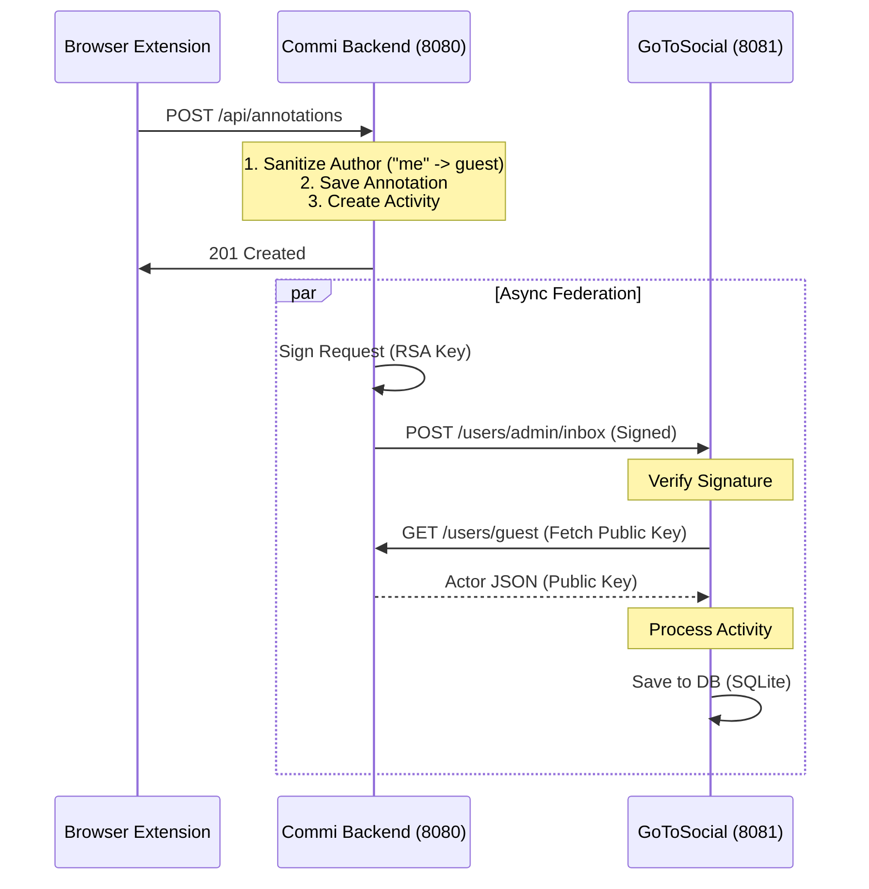

# Data & Event Flow

This document outlines the complete lifecycle of an annotation, from the user's interaction in the browser extension to its federation with a remote ActivityPub server (GoToSocial).

## 1. User Action (Browser Extension)
*   **Trigger**: The user selects text on a webpage (e.g., YouTube) and clicks "Submit" in the Commi sidebar.
*   **Content Script (`content.js`)**: Captures the DOM context (TextQuoteSelector) and sends a message to the background script.
    *   *Payload*: `{ content: "Hello", target: {...}, author: "me" }`

## 2. Network Proxy (Extension Background)
*   **Background Script (`background.js`)**: Receives the `POST_ANNOTATION` message.
*   **Action**: Since content scripts often cannot make direct API calls due to CSP (Content Security Policy), the background script proxies the request.
*   **Request**: Sends a `POST` request to `http://localhost:8080/api/annotations`.

## 3. API Processing (Backend)
*   **Endpoint**: `main.ts` receives the request.
*   **Sanitization**: It checks the `author` field. Since the extension sends `"me"`, the backend detects this is not a valid URL and defaults the author to the local guest actor: `http://localhost:8080/users/guest`.
*   **Persistence**: The annotation is saved to `annotations.json`.

## 4. Federation Logic (Backend)
*   **Activity Construction**: The backend wraps the annotation in an ActivityPub `Create` activity.
    *   *Addressing*: It sets `to` to Public and `cc` to the target admin user.
    *   *Mention Tag*: Crucially, it injects a `Mention` tag for `@admin`. This ensures GoToSocial accepts the message even if the admin doesn't follow the guest user.
*   **Activity Persistence**: The activity object is saved to `activities.json`. This is required so the remote server can "dereference" (look up) the activity later if needed.
*   **Async Delivery**: The `deliverActivity` function is called without awaiting it (fire-and-forget), so the API responds to the extension immediately.

## 5. Secure Delivery (Backend)
*   **Signing (`federation.ts`)**: The backend prepares a POST request to the GoToSocial inbox (`http://localhost:8081/users/admin/inbox`).
*   **HTTP Signature**: It uses the private key from `keys.json` to sign the HTTP headers (`(request-target)`, `host`, `date`, `digest`). This proves the request genuinely came from the Commi backend.

## 6. Reception & Verification (GoToSocial)
*   **Inbox**: GoToSocial receives the POST request.
*   **Key Lookup**: It sees the request is signed by `keyId="http://localhost:8080/users/guest#main-key"`. It makes a GET request to that URL to fetch the public key.
*   **Verification**: It uses the public key to verify the HTTP Signature.
*   **Storage**: Once verified, it parses the ActivityPub JSON. Because of the `Mention` tag, it treats this as a direct notification/status for the admin user and saves it to its SQLite database.

## Visual Flow

