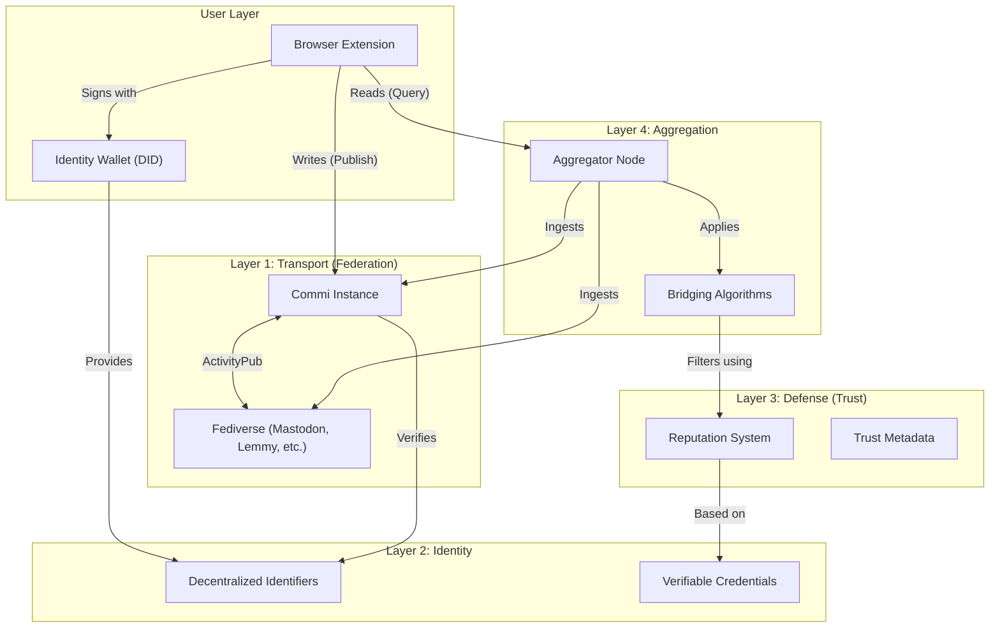

# System Overview

Commi is designed as a decentralized social layer for the web, structured around four key architectural layers. This design ensures censorship resistance, user ownership, and high-quality discourse through protocol-based trust.

## Architecture Diagram

## Layer Breakdown

### 1. Transport Layer (Federation)
*   **Protocol**: ActivityPub
*   **Function**: Enables decentralized communication between Commi instances and the broader Fediverse.
*   **Role**: Acts as the "Home Server" for users. It persists complex annotation data (selectors, target URLs) that generic ActivityPub servers (like Mastodon) might strip out.
*   **Benefit**: Prevents central control; ensures data survival through federation.

### 2. Identity Layer (User Sovereignty)
*   **Technology**: Decentralized Identifiers (DIDs) & Verifiable Credentials.
*   **Function**: Decouples identity from servers. Users own their data and reputation.
*   **Benefit**: Portable identity; no "platform lock-in."

### 3. Defense Layer (Trust & Reputation)
*   **Mechanism**: Proof-of-Humanity & Trust Metadata.
*   **Function**: Filters bots and spam by prioritizing high-reputation human actors.
*   **Benefit**: Sybil resistance without central censorship.

### 4. Aggregation Layer (Curation)
*   **Mechanism**: Aggregator Nodes & Bridging Algorithms.
*   **Function**: Ingests global data and applies consensus algorithms (e.g., Community Notes style) to surface cross-partisan agreement.
*   **Benefit**: Reduces echo chambers; highlights quality content over engagement bait.

## Data Flow Summary

### Write Path (Publishing)
1.  **Creation**: User creates an annotation via the **Browser Extension**, signed with their **DID**.
2.  **Submission**: The extension posts the data to the user's **Commi Instance** (Home Server).
3.  **Federation**: The instance persists the full annotation (including selectors) and federates it to the wider **Fediverse**.

### Read Path (Consumption)
1.  **Ingestion**: **Aggregator Nodes** continuously ingest data from Commi Instances and the Fediverse.
2.  **Curation**: **Bridging Algorithms** analyze the content against the **Reputation System** to filter noise.
3.  **Query**: The **Browser Extension** queries the **Aggregator Node** for high-trust annotations relevant to the current URL.
